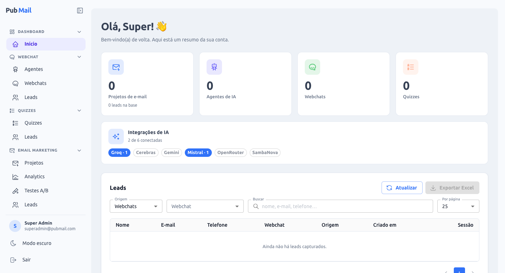
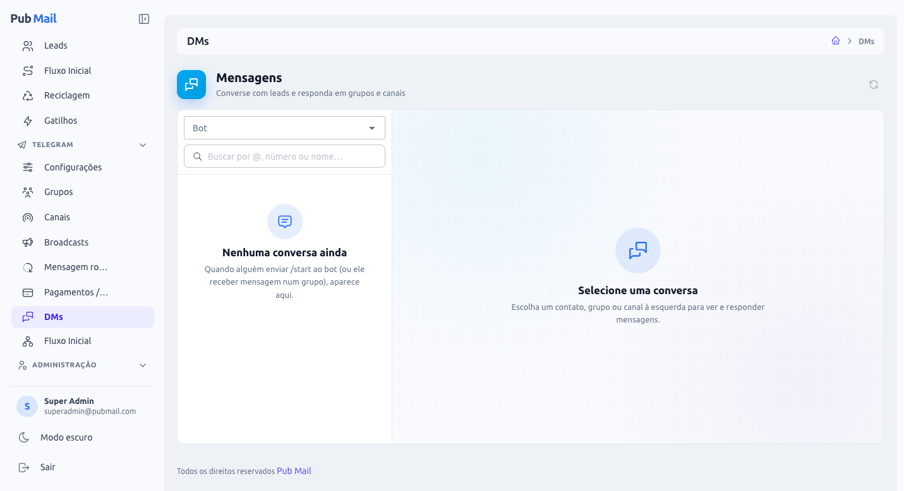
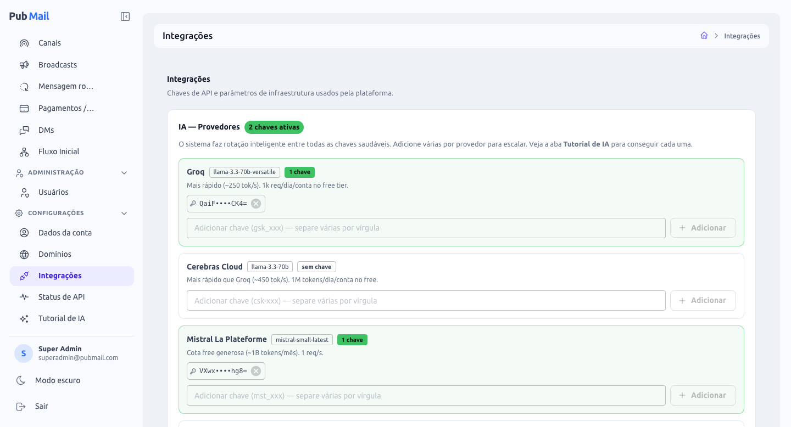

# Pub Mail

<p align="right">
  <a href="README.md"><b>🇧🇷 Português</b></a> · <a href="README.en.md">🇺🇸 Read in English</a>
</p>

Plataforma **multi-tenant** de marketing e automação: **webchats com agentes de IA**, **quizzes**, **e-mail marketing** completo (construtor visual, automações, segmentação, A/B, analytics) e um **módulo Telegram** (bots, DMs, grupos/canais, broadcasts, fluxos, prova social e vendas via PIX). Domínios próprios dos clientes são provisionados automaticamente (nginx + HTTPS Let's Encrypt), e as chamadas de IA fazem rotação inteligente entre múltiplos provedores.



## Sumário

- [Visão geral](#visão-geral)
- [Módulos](#módulos)
  - [Webchat com IA](#webchat-com-ia)
  - [Quizzes](#quizzes)
  - [Email Marketing](#email-marketing)
  - [Leads e Automações](#leads-e-automações)
  - [Telegram](#telegram)
  - [Administração, Integrações e Conta](#administração-integrações-e-conta)
- [Arquitetura](#arquitetura)
- [Stack](#stack)
- [Estrutura do repositório](#estrutura-do-repositório)
- [Rodando localmente](#rodando-localmente)
- [Variáveis de ambiente](#variáveis-de-ambiente)
- [Deploy em produção](#deploy-em-produção)
- [Operação](#operação)
- [Troubleshooting](#troubleshooting)

---

## Visão geral

Cada **organização** (tenant) tem seus usuários, carteira de tokens, agentes, domínios, webchats, quizzes, projetos de e-mail, leads e bots do Telegram — tudo isolado por `organization_id`. Um `SUPER_ADMIN` de plataforma administra organizações e usuários.

O fluxo típico: captar leads (webchat, quiz, formulário no site, Telegram) → nutrir (fluxo inicial, automações, broadcasts, gatilhos) → converter (e-mails, VIP no Telegram com PIX) → medir (analytics, engajamento por lead).

## Módulos

### Webchat com IA

- **Agentes de IA** com persona/produto (`prompt_mestre`), regras de captura de lead e observações.
- **Domínios próprios** (`chat.suamarca.com`): cliente aponta o DNS, clica "Verificar DNS" e o sistema gera o vhost nginx + certificado SSL sozinho. `ads.txt` (IAB) editável por domínio.
- **Webchats** com slug (`/webchat/duvidas`), personalização visual completa, **botões** (quick replies com classes CSS), **páginas legais** no rodapé, **anúncios** (GPT/ADX, rótulo opcional) e layout responsivo (coluna de 720px no desktop).
- **Splits**: pastas de webchats com **redirecionamento ponderado** (`/webchat/splits/<slug>` sorteia entre os membros por peso, com trava anti-loop).
- **Captura inteligente de leads** na conversa (nome/e-mail/telefone/campos custom), multilíngue, com guardrails no prompt; leads podem ser roteados para um projeto de e-mail.
- **Rotação multi-provedor de IA** (Groq, Cerebras, Mistral, OpenRouter, Gemini, SambaNova) com cooldown/quota por chave em Redis e fallback degradado.

### Quizzes

- **Domínios de quiz** (mesmo provisionamento do webchat) e **CRUD de quizzes** com splits ponderados.
- **Construtor visual** (`/quizzes/:id/builder`) com preview real, 3 presets (Clean, Vibrante, Dark Neon), import/export de preset, texto descritivo por pergunta, blocos de conteúdo (texto/imagem/divisor) e classes CSS por botão.
- **Captação de lead** ao final (campos configuráveis) → `quiz_leads` e, se vinculado, o projeto de e-mail.
- **Redirecionamento por resposta** (cada opção pode ter sua URL) ou geral.
- **E-mail imediato ao lead** (HTML/construtor visual, variáveis `{{name}}/{{email}}/{{phone}}`).
- **Anúncios** (topo) espelhados do webchat e **rastreamento pronto para GTM** (`<a>` reais + eventos `dataLayer`: `quiz_answer`, `quiz_lead`, `quiz_complete`).

### Email Marketing

- **Projetos** (listas) com remetente, bloqueio de leads frios e "apenas leads que interagiram no fluxo".
- **Construtor visual por blocos** (texto, imagem, botão rastreado, divisor, espaçador, card, colunas, barra no topo) que gera **HTML mínimo e limpo** para cair na caixa de entrada; **preheader** e **From Name** por template; imagens otimizadas (sharp) servidas direto pelo nginx com cache de 1 ano.
- **Importar templates do Claude**: prompt pronto + planilha `.xlsx/.csv` em formato plano → templates editáveis no construtor.
- **Agendamentos recorrentes** por horário (minuto-do-dia em Brasília), **templates por agendamento**, **disparo manual**, **reenvio para não-abridores**.
- **Segmentação** por regras (abriu/clicou em X dias, taxa de abertura/clique, tags, origem, data de entrada) com contagem ao vivo.
- **Testes A/B** de assunto + template com decisão automática e envio do vencedor ao restante.
- **Formulário de captação v2**: um **único código** copiável (formato WordPress: cola no editor de código e edita no visual) — campos, textos, botão com URL de destino, cores, feedback opcional, tudo configurável e salvo por projeto. Sem e-mail o botão é um link normal; com e-mail capta e redireciona. API pública `POST /email/leads/subscribe/:org/:project` para formulários próprios.
- **Entregabilidade**: validação estrita de e-mail em todas as entradas, higiene automática (conserta/remove inválidos), **webhooks da Resend** (entregue/bounce/spam) com **supressão automática** e estorno de tokens quando nada é enviado.
- **Analytics**: disparos, entregues, aberturas, cliques únicos, bounces, spam, série temporal e engajamento atual da base.

### Leads e Automações

- **Leads** unificados por origem (Webchats, Quizzes, Projetos de e-mail): engajamento por lead, **tags** (edição individual e em massa), filtros server-side, exportação Excel.
- **Fluxo Inicial** (drip por projeto): sequência de e-mails com atrasos, **condições por passo** (só se abriu/clicou o anterior) e **métricas por passo**.
- **Reciclagem (win-back)**: agendamentos que disparam **só para leads frios**.
- **Gatilhos por comportamento**: ao abrir/clicar → adicionar tag ou enviar template, com frequência por lead (uma vez, cooldown, ilimitado).

### Telegram



- **Bots** (token do @BotFather) com webhook automático, revalidação, perfil (nome, descrição, comandos) e **aviso de flood/ban** no card.
- **DMs** estilo Telegram (fotos, emojis, anexos, tags do contato, presença), **Grupos** e **Canais** auto-descobertos (convite, foto, contagem de membros, sair).
- **Fluxo Inicial**: construtor visual (reactflow) com blocos arrastáveis — mensagens múltiplas, mídia/áudio (voice via ffmpeg), atraso "digitando", botões (próximo passo, link, grupo, outro bot, **vender plano**), respostas por texto, tags, deep-link de captação (`?start=`).
- **Automações** temporizadas após o `/start` (condição "inativo", tags, botões).
- **Broadcasts** em massa (DMs + grupos + canais, vários bots) com rotação de copies, horários diários, variáveis (`{{nome}}` etc.), botões inline, fila com rate-limit por bot, status por horário e histórico paginado.
- **Mensagem rotativa (prova social)**: uma mensagem que é **editada em loop** ("Fulano acabou de aderir…") em grupos/canais ou nas DMs, sempre como última mensagem, com travas anti-flood (cadência mínima, teto de edições por lead, detecção de lead que saiu).
- **Pagamentos / VIP**: `/vip` → planos → **PIX** (Mercado Pago ou PushinPay, QR + copia-e-cola com botão de copiar) → validação real no gateway → **link de convite de uso único** para o grupo/canal VIP. **Assinaturas por tempo** com lembrete, expiração (remove do VIP) e renovação. Mensagens do checkout totalmente configuráveis. Botão de plano também em broadcasts, automações e fluxo.

### Administração, Integrações e Conta



- **Administração → Usuários** (`SUPER_ADMIN`): organizações e usuários cross-org, criação de org + admin, troca de senha, exclusão em cascata. Suporte a **organização oculta** do desenvolvedor (invisível para os demais).
- **Integrações**: chaves de IA por provedor **mascaradas** (adicionar/remover por chave, rotação automática), Resend + Signing Secret do webhook, IP de borda e e-mail do certbot. **Status de API** mostra o estado runtime de cada chave; **Tutorial de IA** ensina a obter as chaves.
- **Conta & Domínios**: dados da conta, domínios de webchat e de quiz.
- **Interface**: tema **claro/escuro**, sidebar em grupos recolhíveis, dashboard com resumo da conta.

## Arquitetura

```
┌──────────────────────────────────────────────────────────────┐
│                   nginx (TLS + roteamento)                   │
│  bluewebchat.online          → SPA Vite (estático)           │
│  api.bluewebchat.online      → back :8000 (+ /uploads)       │
│  <domínio-do-cliente>        → SPA + /ads.txt (webchat/quiz) │
└──────────────────────────────────────────────────────────────┘
                     │
                     ▼
              ┌────────────┐   127.0.0.1   ┌────────────┐  ┌────────────┐
              │   Back     │ ────────────▶ │  AI micro  │  │ Email micro│
              │  NestJS    │ ────────────▶ │  :4000     │  │   :9999    │
              │   :8000    │               └─────┬──────┘  └─────┬──────┘
              └─────┬──────┘                     │               │
                    ▼                            ▼               ▼
              ┌──────────┐                 ┌──────────────────────┐
              │  MySQL 8 │                 │        Redis 7       │
              └──────────┘                 └──────────────────────┘
   Externos: Telegram Bot API (webhooks) · Resend (e-mail + webhooks) · Mercado Pago / PushinPay (PIX)
```

- **Front (Vite/React)**: SPA servida pelo nginx no domínio da plataforma e em todos os domínios de cliente (mesmo `dist/`, roteia por `Host`). O browser **só fala com o back**.
- **Back (NestJS)**: API REST (JWT), multi-tenant, provisiona vhosts + certbot, roda os crons/workers (agendamentos, fluxos, A/B, higiene, Telegram) e recebe os webhooks públicos (Telegram, Resend, gateways de pagamento).
- **AI micro** e **Email micro**: só em loopback; o back é o único cliente deles.
- **MySQL 8** (Prisma) e **Redis** (estado das chaves de IA + filas BullMQ de e-mail).

## Stack

| Componente | Versão |
|---|---|
| Node | 20.x |
| Yarn | 4.x (corepack, `nodeLinker: node-modules`) |
| NestJS | 11 |
| Prisma | 7 (adapter MariaDB) |
| React / Vite / MUI | 19 / 7 / 7 |
| reactflow | 11 |
| MySQL | 8.0 |
| Redis | 7 |
| nginx / Certbot | 1.24+ / 2.9+ |
| ffmpeg, libvips (sharp) | dependências de sistema (áudio/imagens) |
| Ubuntu (prod) | 24.04 LTS |

## Estrutura do repositório

```
pub-mail/
├── back/                      # NestJS API + Prisma
│   ├── prisma/                # schema.prisma + migrations
│   └── src/
│       ├── auth/ admin/       # JWT, roles, administração
│       ├── webchats/ quizzes/ # webchat, domínios, quizzes, splits, anúncios
│       ├── email-marketing/   # projetos, templates, leads, flows, ab, triggers, analytics…
│       ├── cron-jobs/         # agendamentos de e-mail
│       ├── telegram/          # bots, chat, fluxos, automações, broadcasts, rotators, payments
│       └── webhooks/          # Resend + tracking de abertura/clique
├── ai-micro-services/         # roteador multi-provedor de IA
├── email-micro-services/      # dispatcher Resend (BullMQ)
├── front/vite/                # SPA React
│   └── src/views/pages/       # webchat, quiz, email, leads, telegram, admin…
├── docs/images/               # imagens deste README
├── docker-compose.yml         # MySQL + Redis + phpMyAdmin para dev local
└── CLAUDE.md                  # notas operacionais detalhadas (deploy, gotchas, histórico)
```

## Rodando localmente

### Pré-requisitos

Node 20, Yarn 4 (corepack), Docker (para MySQL/Redis), `ffmpeg` (áudio do Telegram) e `libvips` (sharp) — ambos opcionais em dev.

### Setup

```bash
# 1. Dependências de infra
docker compose up -d            # MySQL :3306, Redis :6379, phpMyAdmin :8081

# 2. Back
cd back && yarn install
yarn prisma migrate deploy && yarn prisma generate
yarn start:dev                  # :8000

# 3. AI micro (outro terminal)
cd ai-micro-services && yarn install && yarn dev   # :4000

# 4. Email micro (outro terminal)
cd email-micro-services && yarn install && yarn dev   # :9999

# 5. Front (outro terminal)
cd front/vite && yarn install && yarn dev   # :3000
```

> Webhooks (Telegram, Resend, gateways) precisam de uma URL pública — em dev use um túnel (ex.: `ngrok http 8000`) e aponte `PUBLIC_API_URL` para ele.

## Variáveis de ambiente

### Back (NestJS)

| Variável | Default | Descrição |
|---|---|---|
| `PORT` | 8000 | Porta HTTP |
| `DATABASE_HOST/USER/PASS/NAME/PORT` | — | **Conexão usada em runtime** (adapter MariaDB) |
| `DATABASE_URL` | — | Só para o CLI do Prisma (migrate/generate) |
| `DATABASE_POOL_LIMIT` | 10 | **Obrigatório** — o back abre vários pools; com o default (50) estoura o `max_connections` do MySQL |
| `REDIS_HOST` / `REDIS_PORT` | 127.0.0.1 / 6379 | Redis |
| `JWT_ACCESS_SECRET` / `JWT_REFRESH_SECRET` | — | Segredos JWT |
| `IA_SERVICE_URL` / `IA_SERVICE_KEY` | `http://127.0.0.1:4000` | AI micro |
| `EMAIL_SERVICE_URL` / `EMAIL_SERVICE_KEY` | `http://127.0.0.1:9999` | Email micro |
| `PUBLIC_API_URL` | `https://api.bluewebchat.online` | URL pública do back (webhooks do Telegram/pagamentos, formulário de captação) |
| `WEBCHAT_FRONT_DIST` | `/opt/pub-mail/front/vite/dist` | Build do front servido nos domínios de cliente |
| `WEBCHAT_BACKEND_INTERNAL_URL` | `http://127.0.0.1:8000` | Usado nos vhosts gerados para `/ads.txt` |
| `NGINX_SITES_AVAILABLE` / `NGINX_SITES_ENABLED` | `/etc/nginx/...` | Onde o back escreve os vhosts |
| `CERTBOT_BIN` / `CERTBOT_MODE` | `certbot` / `nginx` | Provisionamento SSL |
| `HTTP_BODY_LIMIT`, `UPLOAD_MAX_FILE_SIZE_BYTES` | — | Limites de upload |

Configurações de plataforma (chaves de IA, Resend, webhook secret, IP de borda, e-mail do certbot) ficam no banco (`system_settings`) e são editadas em **Integrações**.

### AI micro

| Variável | Default | Descrição |
|---|---|---|
| `PORT` | 4000 | |
| `IA_SERVICE_KEY` | — | Validado em `x-api-key` |
| `REDIS_HOST` / `REDIS_PORT` | 127.0.0.1 / 6379 | Estado das chaves |
| `OPENROUTER_REFERER` | — | Header recomendado pelo OpenRouter |

### Email micro

| Variável | Default | Descrição |
|---|---|---|
| `PORT` | 9999 | |
| `EMAIL_SERVICE_KEY` | — | Validado em `x-api-key` |
| `REDIS_HOST` / `REDIS_PORT` | 127.0.0.1 / 6379 | Filas BullMQ |
| `NEST_WEBHOOK_URL` | — | Callback interno para o back (resultado do disparo) |
| `BASE_URL_API` | — | URL pública do back (pixel de abertura / clique rastreado) |

### Front (Vite)

| Variável | Obrigatória | Descrição |
|---|---|---|
| `VITE_APP_BASE_NAME` | **sim (`/`)** | Sem isso os assets quebram (tela branca) |
| `VITE_API_URL` | sim | URL pública do back — o browser só fala com ele |

## Deploy em produção

Produção roda em **AWS EC2 (Ubuntu 24.04)**, deploy nativo (sem Docker), serviços `systemd` (`pubmail-back`, `pubmail-ai`, `pubmail-email`), nginx + certbot. O acesso é **somente via AWS SSM** (sem SSH): o código é empacotado, enviado ao S3 e extraído na instância por `aws ssm send-command`.

Resumo do fluxo (detalhes, gotchas e o passo a passo completo estão em `CLAUDE.md`):

```bash
# Front: empacotar → S3 → extrair na instância → build em pasta temporária → swap atômico
cd /opt/pub-mail/front/vite && export NODE_OPTIONS=--max-old-space-size=4096
rm -rf dist_new && yarn build --outDir dist_new
[ -f dist_new/index.html ] && { rm -rf dist_prev; mv dist dist_prev; mv dist_new dist; }

# Back: (se mudou schema) migrate deploy + generate → build → restart só se o build passou
cd /opt/pub-mail/back && yarn prisma migrate deploy && yarn prisma generate
yarn nest build && test -f dist/src/main.js && systemctl restart pubmail-back
```

Pontos de infra que importam:

- **Somente 80/443** abertos. Domínios da plataforma no Cloudflare em **DNS only**; domínios de cliente podem usar proxy (o back aceita os CIDRs do Cloudflare).
- Segredos em `/root/pubmail.secrets`; o back roda como root para escrever vhosts e rodar o certbot.
- `nginx` serve `/uploads` direto do disco (imagens de e-mail/Telegram não passam pelo Node).
- Redis com `maxmemory` + `noeviction`; MySQL com `innodb_buffer_pool_size` ajustado; swap de 2 GB.

## Operação

```bash
journalctl -u pubmail-back -f                      # logs (ou pubmail-ai / pubmail-email)
journalctl -u pubmail-back --since "1 hour ago" -p err
certbot renew                                      # renovação (o timer já faz sozinho)
mysqldump -u pubmail -p pubmail | gzip > backup.sql.gz
```

- **Regenerar vhosts** de todos os domínios: `POST /webchat-domains/regenerate-nginx` (JWT da org) e, se necessário, `certbot --nginx -d <domínio>`.
- **Telegram em flood-wait**: o card do bot mostra "Em pausa" com a hora de retorno; os runners respeitam o `retry_after` sozinhos.

## Troubleshooting

- **Tela branca no front** — `VITE_APP_BASE_NAME=/` precisa existir **antes** do `yarn build`.
- **"Too many connections" no MySQL** — falta `DATABASE_POOL_LIMIT=10` no `back/.env`.
- **`/ads.txt` quebrado em domínio de cliente** — `WEBCHAT_BACKEND_INTERNAL_URL` deve apontar para `:8000`.
- **"Verificar DNS" falha com o DNS correto** — resolver com cache: use `1.1.1.1`/`8.8.8.8` no `systemd-resolved` e reinicie o back.
- **certbot "Another instance is already running"** — `pkill -f certbot && rm -f /var/lib/letsencrypt/.certbot.lock`.
- **Disparo com 0 enviados** — e-mail inválido derrubava o lote (corrigido: validação + fallback individual + estorno de tokens). Verifique `error_message` no envio.
- **Bot do Telegram não responde** — veja o card em Telegram → Configurações: token revogado (permanente, recadastrar) ou flood-wait (temporário, volta sozinho).
- **Yarn 4 + Prisma** — sempre `nodeLinker: node-modules` no `.yarnrc.yml`.

---

**Licença**: privada / proprietária.
